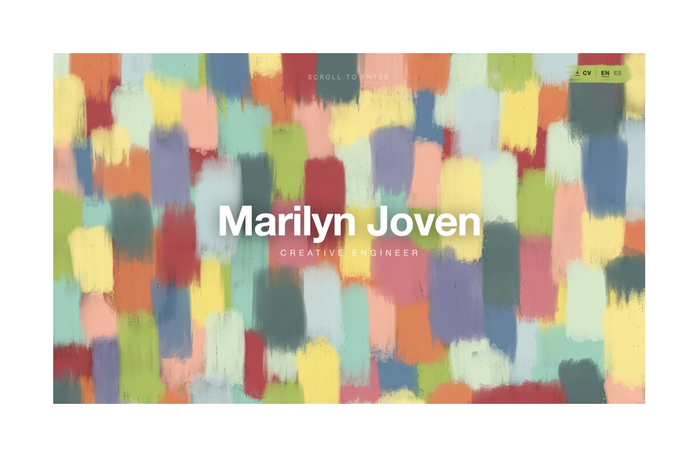
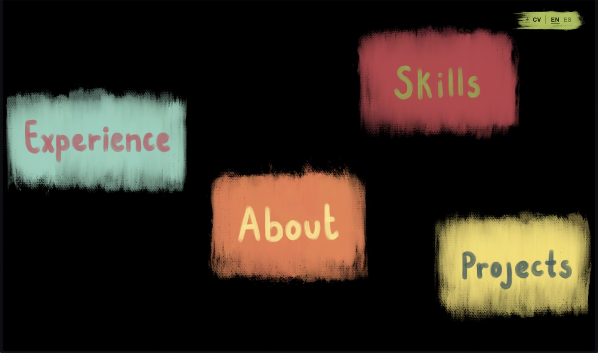

# Marilyn Joven — Portfolio

**Live site: [marilyn-joven.vercel.app](https://marilyn-joven.vercel.app/)**

**CV:** [English (PDF)](https://marilyn-joven.vercel.app/cv/cv-en.pdf) · [Español (PDF)](https://marilyn-joven.vercel.app/cv/cv-es.pdf)

An interactive 3D portfolio built with React and Three.js. Instead of a scrolling page, you fly through a stack of hand-painted layers into a menu of painted labels, and each label zooms you into its own section.

**All the designs on the site were painted by me**, from the brush-stroke entry layers to the lettered menu labels.





## What's inside

- **Entry:** four painted layers line up into one image. Scrolling pulls them apart like a curtain as the camera flies through.
- **Menu:** four painted labels (About, Experience, Projects, Skills) that parallax with the mouse. Click one and the camera zooms into it until its color fills the screen.
- **About:** a small 3D room you can turn around in. The back wall has a short bio, the left wall shows strengths, languages and a framed photo, and the right wall explains the site and links to GitHub, LinkedIn and the CV.
- **Experience:** a film strip that assembles frame by frame. Click a photo to zoom into it and read the role, stamped on like the date on a disposable-camera print.
- **Projects:** an iPad-style home screen with app icons and image widgets that link to each project.
- **Skills:** black-and-white tech icons that lean toward the cursor. Rub over one to paint its color back in.

The whole site switches between English and Spanish, and the CV download follows the chosen language. On phones and upright tablets the layout changes to a vertical one.

## Tech stack

- [React 19](https://react.dev/) + [Vite](https://vite.dev/)
- [Three.js](https://threejs.org/) via [React Three Fiber](https://r3f.docs.pmnd.rs/) and [drei](https://drei.docs.pmnd.rs/)
- Deployed on [Vercel](https://vercel.com/) with Vercel Analytics

## Running locally

```bash
npm install
npm run dev      # start the dev server
npm run build    # production build into dist/
npm run preview  # serve the production build
```

## Editing content

Most content lives in plain config files, so you rarely need to touch the scene code:

| File | Controls |
| --- | --- |
| `src/aboutConfig.js` | About room wall text, links and the framed photo |
| `src/experienceConfig.js` | Experience roles, dates, notes and photo hotspots |
| `src/homeConfig.js` | Projects home-screen tiles and dock |
| `src/skillsConfig.js` | Skill icons, their positions and the row labels |
| `src/i18n.js` | Interface text in English and Spanish, and the CV file paths |
| `src/three/config.js` | Camera, layer spacing, zoom and animation settings |

The CVs are served from `public/cv/`.
